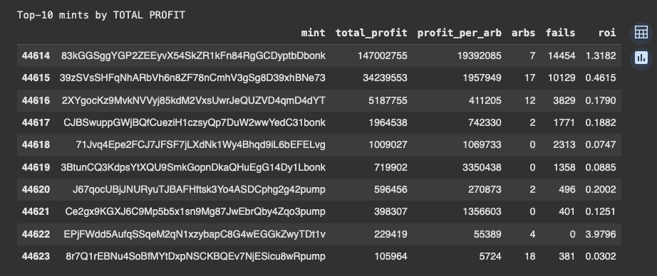

<!-- README.md -->
<h1 align="center">arb-assist → SMB Dashboard</h1>

  <em>Turn raw <code>arb-assist</code> logs into data-driven <code>smb-onchain</code> configs in one Colab run.</em>

  
  &nbsp;
  

---

## ✨ What it does
* **Reads** yesterday’s `arb-assist-log.csv`
* **Builds** a full dashboard (quantile table, histograms, 5-min profit curve)
* **Generates** a ready-to-paste **`[[filter_thresholds]]`** block with sane floors/caps
* **Flags** mints that blow the 128-account limit
* **Exports** an interactive `profile.html`
* **Emits** a Markdown KPI snippet you can drop into Discord/Slack

 

## 🚀 Quick start
| use-case | steps |
| --- | --- |
| **Colab (zero local deps)** | 1. open the notebook link 2. upload your `arb-assist-log.csv` (left sidebar → Files → Upload) 3. `Runtime ▸ Run all` 4. copy the printed `filter_thresholds` block → paste into `arb-assist.toml` |
| **CLI (server / cron)** | `python tiers_builder.py path/to/arb-assist-log.csv > tiers.toml` |

 

## 📊 Sample output screenshot

 

## 📝 Advice & gotchas

| symptom | fix |
| --- | --- |
| *“Transaction too large”* | lower `top_pool_num`, set `merge_mints = false`, or drop `aluts_per_pool` to ≤ 3 |
| no mints ever pass your tiers | lower `min_profit` & `min_roi` in the **Scout** tier, or set `filter_programs = false` so organic swaps count |
| CU / Jito tips feel random | use the histogram & quantile read-out—map 75 %→90 % to Level-2 and 90 %→99 % to Level-3 |
| want a GUI | open `profile.html` that the notebook saves in the repo root |

 

## 🛠 Project layout
